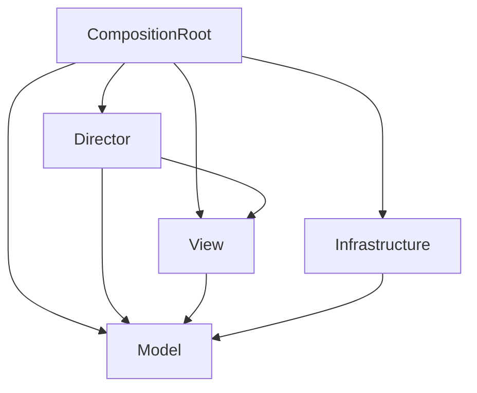

# hackathon-26-spring-15

made from [Unity Single Scene Template](https://github.com/kageki128/unity-single-scene-template)

春ハッカソン2026 15班

## ゲーム概要

2Dのエンドレスな横スクロールランナー

プレイヤーは常に右に移動している。プレイヤーは以下の操作ができる。

- →キー: 加速
- ↑キー: ジャンプ

プレイヤーは最初、デフォルト速度で走っている。加速キーを押している間は加速時速度で走る。

走っているとギミックが流れてくる。現状以下の通り(変更の予定あり)

- 加速オブジェ: 加速しないで通過するとダメージ
- 反加速オブジェ: 加速して通過するとダメージ

クリアしたギミックの数を得点とする。

## 技術スタック

### Unityレジストリ

- TextMeshPro
- Addressables
- Newtonsoft Json

### 外部ライブラリ

- UniTask
- R3 (+ Observable Collection)
- VContainer
- LitMotion (+ LitMotion.Animation)
- Unityroom Client Library
- Kyub EmojiSearch API

### エディタ拡張

- vHierarchy 2
- Auto Save

## アーキテクチャ

ゲーム制作においてドメインとフレームワークを切り離すことが困難なことを考慮したアーキテクチャ。Pure C#のModelとMonoBehaviourのViewの両方でドメインを担当し、Directorがそれをオーケストレーションする。開発速度と保守性が両立でき、初学者にも分かりやすい。

注意: ここにおいてPure C#なクラスとはMonoBehaviourを継承しないクラスと定義する。簡単のため、Pure C#であっても必要ならMathfやVector3などのUnityライブラリ、R3, UniTaskなどの外部ライブラリは使用しても構わない。

### Model層

Pure C#で書かれる。従来のドメイン層に相当し、単一のドメインを可能な限り集約しカプセル化する。ただし、MonoBehaviour側に書いたほうが都合が良い部分については、無理せずView層に分離することを許可する。

### View層

MonoBehaviourを継承する。2DモデルやuGUIなど、ゲーム画面に映るオブジェクトを担当する。必要ならここにドメインを書いたり、Model層のメソッドを叩いたりしてもよい。ただし、特に理由が無いのであれば、可能な限りMVRPパターンにおけるView (完全に受け身なオブジェクト) のように振る舞い、イベントを通知し、Directorに処理をハンドリングさせる形になるよう努めること。

### Director層

Pure C#で書かれる。MVRPパターンにおけるPresenterに相当する。Viewのイベントを購読してModelを操作、あるいはその逆を行う。具体的なロジックは書かず、ModelやViewに委譲する。また、Sceneにただひとつ、DirectorのRootたるEntryPointを用意し、ライフサイクルメソッドはここに集約される。

### Infrastructure層

基本的にPure C#で書かれる。セーブやロード、サーバーといった技術的感心を集約し、Model層のPortを実装する。

### CompositionRoot層

MonoBehaviourを継承する。DIコンテナを用いて依存性の解決とEntryPointのライフサイクルメソッドの起動を行う。DIの関係で特権的に全ての層に依存する。

### 依存関係

## コーディング規約

- private修飾子は省略
- privateフィールドの接頭辞にアンダースコアをつけない
- UniTaskのメソッドは可能な限り有効なCancellationTokenを渡す/渡せるようにする
- R3の購読管理はCompositionDisposableを用いて確実に行う
- テストはUnity Test Runnerを用い、テストコードはScripts/Tests以下に配置する
