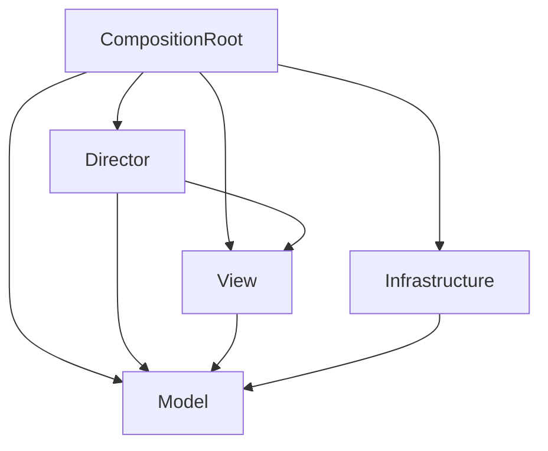

# Unity Single Scene Template

単一のSceneでゲームを構成するUnityプロジェクトテンプレート

## 使用方法

### 0. 必要なものがインストールされているか確認

- Git LFS
    - `git lfs install` まで実行したか
- EditorConfig拡張機能

### 1. リポジトリを複製

テンプレートをコピーしたあと、`git` 履歴を消して新しい履歴で開始する。

1. `git clone [template-repository-url]`
2. `cd unity-single-scene-template`
3. `git lfs pull`
4. `.git` ディレクトリを削除
    - macOS / Linux: `rm -rf .git`
    - Windows (PowerShell): `Remove-Item -Recurse -Force .git`
5. `git init`
6. `git remote add origin [new-repository-url]`
7. `git add .`
8. `git commit -m "Initial commit from template"`
9. `git branch -M main`
10. `git push -u origin main`

### 2. 新プロジェクト用に修正

- 名前の修正
- 必要パッケージの追加インストール
    - Cinemachine
- 環境設定からAutoSaveを有効化
- `README.md`, `AGENTS.md` を更新

### 3. ビルド前

- unityroomのHmac Keyを入力

---

以下テンプレート

# [ここにプロジェクト名を入力]

made from [Unity Single Scene Template](https://github.com/kageki128/unity-single-scene-template)

[ここにプロジェクトの説明を入力]

## ゲーム概要

[ここにゲームの詳しい説明を入力]

## 技術スタック

### Unityレジストリ

- TextMeshPro
- Addressables
- Newtonsoft Json

### 外部ライブラリ

- UniTask
- R3 (+ Observable Collection)
- VContainer
- LitMotion (+ LitMotion.Animation)
- Unityroom Client Library
- Kyub EmojiSearch API

### エディタ拡張

- vHierarchy 2
- Auto Save

## アーキテクチャ

ゲーム制作においてドメインとフレームワークを切り離すことが困難なことを考慮したアーキテクチャ。Pure C#のModelとMonoBehaviourのViewの両方でドメインを担当し、Directorがそれをオーケストレーションする。開発速度と保守性が両立でき、初学者にも分かりやすい。

注意: ここにおいてPure C#なクラスとはMonoBehaviourを継承しないクラスと定義する。簡単のため、Pure C#であっても必要ならMathfやVector3などのUnityライブラリ、R3, UniTaskなどの外部ライブラリは使用しても構わない。

### Model層

Pure C#で書かれる。従来のドメイン層に相当し、単一のドメインを可能な限り集約しカプセル化する。ただし、MonoBehaviour側に書いたほうが都合が良い部分については、無理せずView層に分離することを許可する。

### View層

MonoBehaviourを継承する。2DモデルやuGUIなど、ゲーム画面に映るオブジェクトを担当する。必要ならここにドメインを書いたり、Model層のメソッドを叩いたりしてもよい。ただし、特に理由が無いのであれば、可能な限りMVRPパターンにおけるView (完全に受け身なオブジェクト) のように振る舞い、イベントを通知し、Directorに処理をハンドリングさせる形になるよう努めること。

### Director層

Pure C#で書かれる。MVRPパターンにおけるPresenterに相当する。Viewのイベントを購読してModelを操作、あるいはその逆を行う。具体的なロジックは書かず、ModelやViewに委譲する。また、Sceneにただひとつ、DirectorのRootたるEntryPointを用意し、ライフサイクルメソッドはここに集約される。

### Infrastructure層

基本的にPure C#で書かれる。セーブやロード、サーバーといった技術的感心を集約し、Model層のPortを実装する。

### CompositionRoot層

MonoBehaviourを継承する。DIコンテナを用いて依存性の解決とEntryPointのライフサイクルメソッドの起動を行う。DIの関係で特権的に全ての層に依存する。

### 依存関係

## コーディング規約

- private修飾子は省略
- privateフィールドの接頭辞にアンダースコアをつけない
- UniTaskのメソッドは可能な限り有効なCancellationTokenを渡す/渡せるようにする
- R3の購読管理はCompositionDisposableを用いて確実に行う
- テストはUnity Test Runnerを用い、テストコードはScripts/Tests以下に配置する
